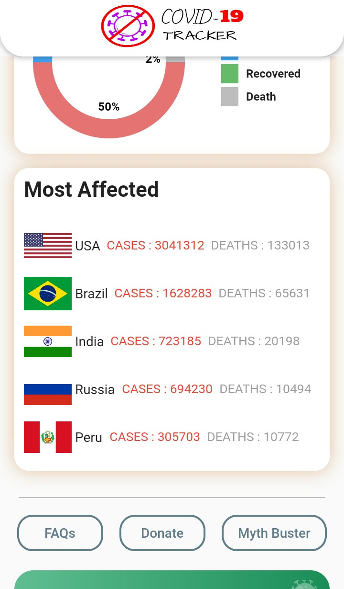
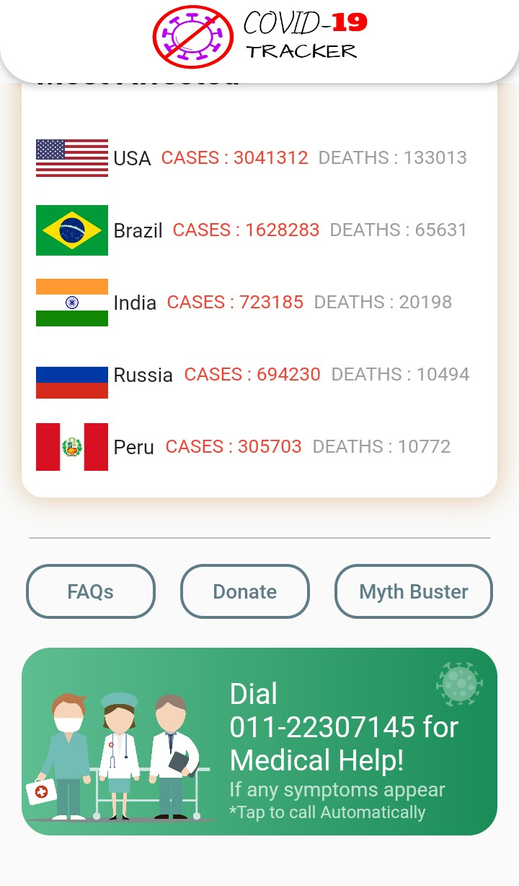

# covid-19 Tracker

It is Flutter App exported for Android Application that has the capabilty to track Covid-19 Spread All Over the World.

here the Data is Driven From WHO & Govt websites using highly secure and Verified Api's

| Splash Screen     | Symtoms & Precautions      | India Stats      |
|------------|-------------|-------------|
|  |  |  |

| Total Cases     | Most Affected      | Info Panel      |
|------------|-------------|-------------|
|  |  |  |

| India State Stats     | Countries Stats     | FAQs      |
|------------|-------------|-------------|
|  |  |  |

